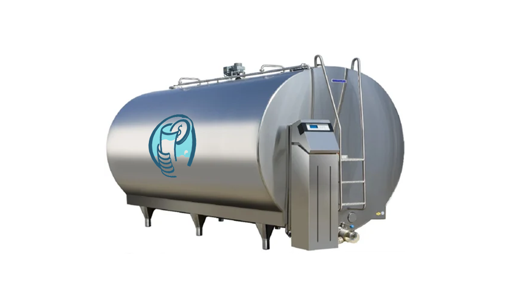

# Filiera-Token

## Introduzione

Benvenuti nel progetto FilieraToken!

Il sistema proposto si concentra sulla gestione della filiera lattiero-casearia attraverso un'applicazione distribuita (DApp) basata su tecnologia blockchain. Questa soluzione innovativa, chiamata FilieraToken, mira a garantire la trasparenza, l'efficienza e la tracciabilità lungo l'intera catena di produzione e distribuzione del formaggio.

### Attori della Filiera:

| Ruolo Attore | Descrizione | Immagine |
| ------------ | ----------- | -------- |
| Centro di Raccolta e Trasformazione del Latte | Il Centro di Raccolta e Trasformazione del Latte svolge un ruolo cruciale nel processo di produzione. È responsabile della raccolta del latte dalle aziende agricole, della sua trasformazione in formaggio e della distribuzione ai successivi attori della filiera. |  |
| Produttore di Formaggio | Il Produttore di Formaggio riceve il latte trasformato dal Centro di Raccolta e Trasformazione del Latte e lo utilizza per creare i prodotti caseari. Utilizzando la tecnologia blockchain, ogni passaggio nella produzione del formaggio viene registrato in modo sicuro e immutabile. |  |
| Retailer | Il Retailer è l'ultimo anello della catena di distribuzione prima che il formaggio raggiunga il consumatore finale. Grazie a CheeseChain, il Retailer può garantire ai propri clienti la provenienza e la qualità del formaggio offerto. |  |
| Consumatore | Il Consumatore rappresenta il destinatario finale del formaggio. Grazie alla tracciabilità garantita dalla tecnologia blockchain, il Consumatore può avere fiducia nell'origine e nella qualità del prodotto che sta acquistando. |  |

### Prodotti:

| Nome del Prodotto | Descrizione | Immagine |
| ----------------- | ----------- | -------- |
| CheeseBlock (Blocco di Formaggio) | Il CheeseBlock rappresenta un'unità di formaggio prodotta e distribuita lungo la filiera. Ogni CheeseBlock è unico e identificabile attraverso il suo hash sulla blockchain di CheeseChain. |  |
| CheesePiece (Pezzetto di Formaggio) | Il CheesePiece è una frazione più piccola del formaggio, spesso utilizzata per degustazioni o per la preparazione di piatti specifici. Anche il CheesePiece è tracciabile attraverso la blockchain di CheeseChain. |  |
| MilkBatch (Partita di Latte) | Il MilkBatch è una partita specifica di latte raccolto e trasformato in formaggio. Ogni MilkBatch è registrato sulla blockchain insieme alle informazioni riguardanti la sua origine e il suo percorso nella filiera. |  |

## Architettura

L'architettura del sistema è composta dalle seguenti componenti e tecnologie:

### Componenti:

1. **Docker:** 
   Docker permette di creare un ambiente virtuale isolato per l'esecuzione di Firefly. Questo fornisce un'infrastruttura modulare e scalabile per la gestione delle applicazioni blockchain.

2. **Firefly:** 
   Firefly rappresenta il nucleo del sistema, fornendo la piattaforma e le funzionalità essenziali per la gestione della filiera lattiero-casearia tramite la tecnologia blockchain.

3. **Hyperledger Besu:** 
   Hyperledger Besu è un client Ethereum completo che implementa la specifica Ethereum Proof of Authority (PoA). È utilizzato per l'interazione con la blockchain Ethereum e per l'esecuzione dei contratti intelligenti.

4. **Truffle:** 
   Truffle è un framework di sviluppo per la scrittura e la migrazione di smart contract. Fornisce strumenti per lo sviluppo, il testing e la distribuzione di contratti intelligenti su blockchain Ethereum.

5. **HardHat:** 
   Hardhat è un framework di sviluppo per la scrittura e la migrazione di smart contract. Fornisce strumenti per lo sviluppo, il testing e la distribuzione di contratti intelligenti su blockchain Ethereum.

### Tecnologie:

1. **Python:** 
   Python è il linguaggio di programmazione utilizzato per lo sviluppo di Firefly. Offre flessibilità e facilità di sviluppo per implementare le funzionalità del sistema.

2. **Solidity:** 
   Solidity è il linguaggio di programmazione utilizzato per lo sviluppo di Hyperledger Besu. È noto per le sue prestazioni elevate e la concorrenza incorporata, rendendolo ideale per applicazioni blockchain.

3. **Flutter:** 
   Flutter è un framework open-source sviluppato da Google per la creazione di app mobili multi-piattaforma. Utilizza il linguaggio di programmazione Dart e offre un'ampia gamma di widget personalizzabili e un sistema di rendering veloce, consentendo agli sviluppatori di creare app con una sola base di codice che possono essere eseguite su diverse piattaforme come iOS, Android e Web.

4. **JWT (JSON Web Token):** 
   JWT è uno standard aperto (RFC 7519) che definisce un modo compatto e autonomo per trasmettere informazioni in sicurezza tra due parti come un oggetto JSON. È comunemente utilizzato per autenticare e autorizzare gli utenti in applicazioni web e API RESTful.

5. **Metamask:** 
   Metamask è un'estensione del browser che consente agli utenti di gestire facilmente il proprio portafoglio Ethereum e interagire con le DApp (Decentralized Applications) sulla blockchain Ethereum direttamente dal browser. Fornisce un'interfaccia utente intuitiva e sicura per eseguire transazioni, firmare messaggi e interagire con i contratti intelligenti.

## Navigazione

Gli utenti hanno accesso alle seguenti pagine in base al loro ruolo:

- **Guest**: L'utente in modalità guest può accedere solo alle pagine di Login e SignUp per registrarsi o accedere al sistema.
- **MilkHub**: L'utente MilkHub ha accesso alle pagine di Inventory e Setting per gestire i propri dati e le proprie preferenze.
- **CheeseProducer**: L'utente CheeseProducer ha accesso alle pagine di Shop, Inventory, Setting e Product Buyed per gestire i propri prodotti, visualizzare gli acquisti passati e modificare le impostazioni.
- **Retailer**: L'utente Retailer ha accesso alle pagine di Shop, Inventory, Setting e Product Buyed per visualizzare e gestire i propri prodotti, nonché per modificare le impostazioni.
- **Consumer**: L'utente Consumer ha accesso alle pagine di Shop, Product Buyed e Setting per navigare tra i prodotti disponibili, visualizzare gli acquisti passati e modificare le impostazioni del proprio account.

### Pagine:

| Nome della Pagina | Descrizione | Immagine |
| ----------------- | ----------- | -------- |
| Login | Pagina di accesso per gli utenti registrati. Qui gli utenti possono inserire le proprie credenziali per accedere al sistema. |  |
| SignUp | Pagina di registrazione per i nuovi utenti. Qui gli utenti possono creare un nuovo account fornendo le informazioni richieste. |  |
| Shop | Pagina principale del negozio, dove gli utenti possono visualizzare e acquistare i prodotti disponibili. |  |
| Product Buyed | Pagina dove gli utenti possono visualizzare i prodotti che hanno acquistato in passato. |  |
| Inventory | Pagina dove gli utenti possono gestire i propri prodotti e metterli in vendita nel negozio. |  |
| Setting | Pagina delle impostazioni, dove gli utenti possono visualizzare e modificare le proprie informazioni personali e le preferenze del sistema. |  |

## UseCase
Presentazione di casi d'uso o scenari tipici.

### Sottosezione 1
Descrizione di un caso d'uso specifico.

### Sottosezione 2
Altri casi d'uso rilevanti.

## Conclusioni
Sintesi delle principali conclusioni tratte dal documento.

## Riferimenti
Eventuali riferimenti o fonti utilizzate.

